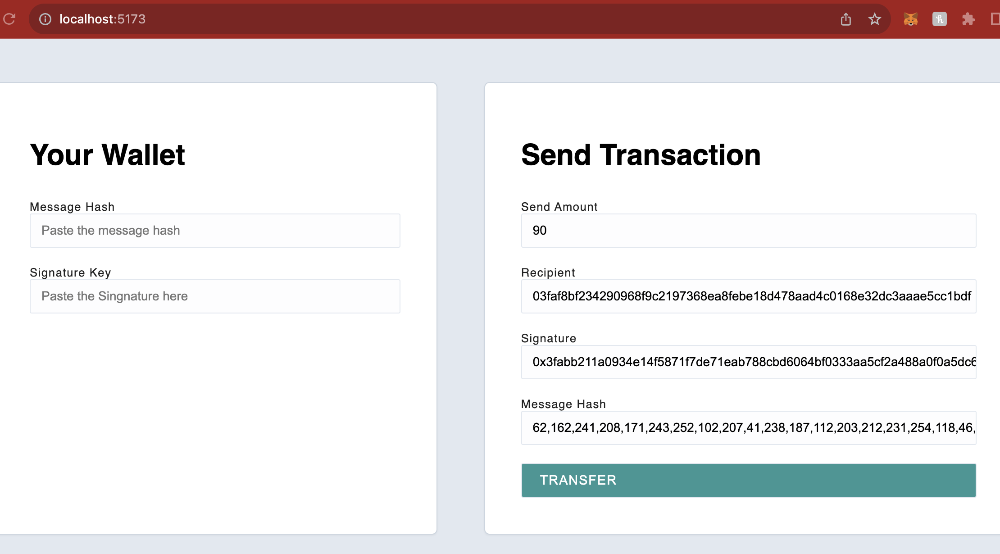

## ECDSA Node

Modified the Transfer component to pass Signature and Message Hash to the server

### Video instructions

For an overview of this project as well as getting started instructions, check out the following video:

https://www.loom.com/share/0d3c74890b8e44a5918c4cacb3f646c4

### Client

Modified the Transfer component to pass Signature and Message Hash to the server

### Server

# Scripts

1. recoverPublicKey.js : Use the script to generate the Signature Hex and the Message Hash
   Use these values to populate the Signature and Message Hash input fields on the client side.
